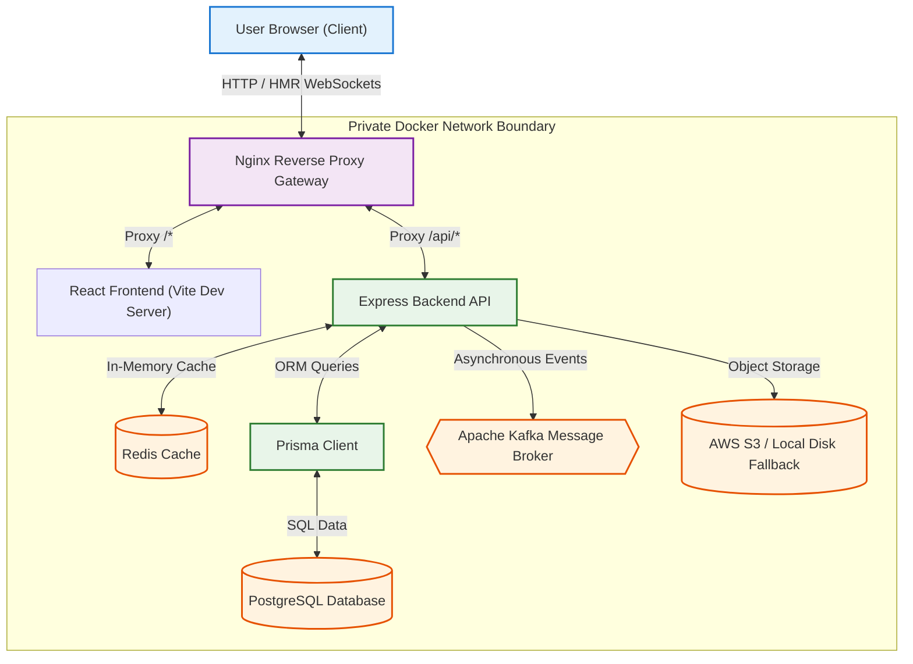

# College ERP: High-Concurrency Distributed System & Relational Architecture 🎓

College ERP is a modernized, high-performance web portal built from scratch to support high-concurrency student and faculty management. The system is engineered around a modular, containerized microservices architecture with low-latency caching, async event pipelines, and secure reverse proxy routing.

---

## 🏗️ System Architecture

The application is structured into five isolated containerized services orchestrated behind an Nginx API Gateway, decoupling the frontend delivery, backend query engine, in-memory cache layer, message broker, and relational storage.



---

## 🌟 Key Features & Innovations

*   **Vite React Client Integration:** Modernized the entire build layer using Vite and esbuild, replacing legacy Webpack configs and **reducing local development and hot module replacement (HMR) load times to 1.03 seconds**.
*   **Prisma & PostgreSQL Relational Engine:** Normalised persistence schema definitions with foreign keys, compound indexes, and cascading delete constraints. Resolved database bottlenecks by replacing looping lookups with batch SQL transactions, **decreasing query count by 95%** on grade/attendance modules.
*   **In-Memory Caching (Redis):** Integrated custom Express caching middleware utilizing request-payload hashing to store database search requests, **delivering sub-8ms read latencies** on static assets, backed by auto-invalidation triggers on database write operations.
*   **Asynchronous Messaging (Apache Kafka):** Offloaded system notices and student registration welcome emails to Kafka message queues, decoupling non-blocking network requests from client-perceived response times.
*   **Microservices Containerization (Docker):** Composed a reproducible development and production environment isolating Node API (Debian-slim), React Client (Alpine), Redis, PostgreSQL, and Nginx.
*   **Secure API Gateway (Nginx):** Unified client assets and API endpoints behind a single entry gateway, implementing WebSockets upgrade configurations for Vite's HMR system.
*   **Binary S3 Offloading:** Extracted raw avatar image payloads from database transactions, uploading them securely to AWS S3 storage buckets with local disk cache fallbacks.

---

## 🚀 Quick Start

### 1. Prerequisites
Ensure you have **Docker Desktop** installed and running on your system.

### 2. Composition
Boot the entire distributed system with a single command:
```bash
docker-compose up --build
```
This command automatically downloads the base images, builds the custom containers, applies relational database schemas using Prisma, and seeds the initial administrator account.

### 3. Application Access
Once the containers are online:
*   **Web Portal:** Open `http://localhost:8080` in your browser.
*   **Default Administrator Login:**
    *   **Username:** `ADMDUMMY`
    *   **Password:** `123`

---

## 📂 Directory Map

```text
├── client/                 # React SPA built with Vite
│   ├── src/                # Component layers, Redux actions & reducers
│   ├── index.html          # Entry document
│   ├── vite.config.js      # Compiler & HMR rules
│   └── Dockerfile          # Alpine build configuration
│
├── server/                 # Node.js API Service
│   ├── config/             # Connection managers (Redis, Kafka, DB)
│   ├── controller/         # Relational query logic & API endpoints
│   ├── middleware/         # Caching filters, JWT interceptors & schemas
│   ├── prisma/             # Schema.prisma and migration hooks
│   └── Dockerfile          # Debian-slim server image
│
├── nginx/                  # Gateway Router
│   └── default.conf        # Proxy rules and WebSockets forwarding
│
└── docker-compose.yml      # Service composition orchestrator
```
